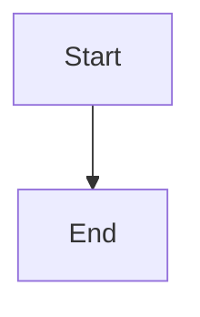

# Mermaid Removal & Client-Side Rendering Implementation Plan

> **For agentic workers:** REQUIRED: Use superpowers:subagent-driven-development (if subagents available) or superpowers:executing-plans to implement this plan. Steps use checkbox (`- [ ]`) syntax for tracking.

**Goal:** Remove backend Mermaid diagram generation and frontend `mermaid` npm dependency, replacing it with client-side rendering of `language-mermaid` code blocks inside `react-markdown` via dynamic CDN import.

**Architecture:** The LLM will embed Mermaid syntax directly inside the summary markdown as fenced code blocks (```` ```mermaid ````). A custom `react-markdown` component intercepts these blocks and renders them client-side using a dynamically imported Mermaid library from CDN, bypassing Next.js bundler issues.

**Tech Stack:** Next.js 15 App Router, React, react-markdown, Tailwind, FastAPI, SQLAlchemy, Alembic

---

## File Structure

| File | Responsibility |
|---|---|
| `backend/src/chains/summary_chain.py` | Remove separate diagram LLM call; embed mermaid in markdown content |
| `backend/src/db/models.py` | Remove `diagram_syntax` and `diagram_type` columns from `Summary` model |
| `backend/src/api/v1/schemas/summary.py` | Remove `diagram_syntax` and `diagram_type` from `SummaryResponse` |
| `backend/src/api/v1/routers/summaries.py` | Remove diagram fields from response serialization |
| `backend/src/worker.py` | Remove diagram fields from job result persistence |
| `backend/alembic/versions/..._remove_mermaid_columns.py` | Migration to drop `diagram_syntax` and `diagram_type` columns |
| `frontend/src/components/features/summary/mermaid-diagram.tsx` | DELETE — no longer needed |
| `frontend/src/components/features/summary/mermaid-block.tsx` | NEW — client-side mermaid renderer using CDN import |
| `frontend/src/components/features/summary/rich-markdown.tsx` | Modify — add `code` component override for `language-mermaid` |
| `frontend/src/components/features/summary/paginated-reader.tsx` | Modify — wire `MermaidBlock` into markdown renderer |
| `frontend/src/app/(app)/summaries/[id]/page.tsx` | Remove `MermaidDiagram` import and conditional rendering |
| `frontend/package.json` | Remove `mermaid` dependency |

---

## Chunk 1: Backend — Remove Mermaid Generation

### Task 1: Update Summary Chain Prompt

**Files:**
- Modify: `backend/src/chains/summary_chain.py`

- [ ] **Step 1: Remove diagram generation LLM call**

Find the parallel `asyncio.gather` call that runs diagram generation alongside content analysis. Remove the diagram generation coroutine entirely.

```python
# BEFORE (approximate):
# diagram_future = generate_diagram(summary_content)
# analysis_future = run_content_analysis(...)
# diagram_result, analysis_result = await asyncio.gather(diagram_future, analysis_future)

# AFTER:
analysis_result = await run_content_analysis(...)
```

- [ ] **Step 2: Update return type and prompt**

Modify `SummaryChainOutput` to remove `diagram_syntax` and `diagram_type`:

```python
class SummaryChainOutput(TypedDict):
    content: str
    quiz_type_flags: dict[str, Any]
```

Update the final generation prompt to instruct the LLM to embed mermaid diagrams inside the markdown content when applicable:

```
If the content naturally lends itself to a visual diagram (flowcharts, relationships, hierarchies),
include a Mermaid.js diagram inside a fenced code block like this:



Otherwise, do not include a diagram.
```

- [ ] **Step 3: Commit**

```bash
git add backend/src/chains/summary_chain.py
git commit -m "feat: remove separate mermaid generation, embed in markdown"
```

### Task 2: Update Database Models

**Files:**
- Modify: `backend/src/db/models.py`
- Create: `backend/alembic/versions/..._remove_mermaid_columns.py`

- [ ] **Step 1: Remove diagram columns from SQLAlchemy model**

```python
# In backend/src/db/models.py, class Summary:
# REMOVE these lines:
# diagram_syntax: Mapped[str | None] = mapped_column(Text, nullable=True)
# diagram_type: Mapped[str | None] = mapped_column(Text, nullable=True)
```

- [ ] **Step 2: Write Alembic migration**

```python
"""remove mermaid columns from summaries

Revision ID: ...
Revises: ...
Create Date: ...
"""
from alembic import op
import sqlalchemy as sa

# revision identifiers, used by Alembic.
revision = '...'
down_revision = '...'
branch_labels = None
depends_on = None

def upgrade():
    op.drop_column('summaries', 'diagram_syntax')
    op.drop_column('summaries', 'diagram_type')

def downgrade():
    op.add_column('summaries', sa.Column('diagram_syntax', sa.Text(), nullable=True))
    op.add_column('summaries', sa.Column('diagram_type', sa.Text(), nullable=True))
```

- [ ] **Step 3: Run migration locally**

```bash
cd backend
alembic upgrade head
```

Expected: Migration completes without errors.

- [ ] **Step 4: Commit**

```bash
git add backend/src/db/models.py backend/alembic/versions/..._remove_mermaid_columns.py
git commit -m "feat: drop diagram_syntax and diagram_type columns from summaries"
```

### Task 3: Update API Schema and Router

**Files:**
- Modify: `backend/src/api/v1/schemas/summary.py`
- Modify: `backend/src/api/v1/routers/summaries.py`

- [ ] **Step 1: Remove diagram fields from Pydantic schema**

```python
# In backend/src/api/v1/schemas/summary.py, class SummaryResponse:
# REMOVE:
# diagram_syntax: str | None
# diagram_type: str | None
```

- [ ] **Step 2: Remove diagram fields from router serialization**

```python
# In backend/src/api/v1/routers/summaries.py, _to_summary_response():
# REMOVE diagram_syntax and diagram_type from the returned dict/model
```

- [ ] **Step 3: Update worker persistence**

```python
# In backend/src/worker.py, run_summary_job():
# Remove diagram_syntax and diagram_type from the .values() update
# On failure, also remove them from the clear-values call
```

- [ ] **Step 4: Commit**

```bash
git add backend/src/api/v1/schemas/summary.py backend/src/api/v1/routers/summaries.py backend/src/worker.py
git commit -m "feat: remove diagram fields from API and worker"
```

### Task 4: Update Backend Tests

**Files:**
- Modify: `backend/tests/test_summaries_router.py`
- Modify: `backend/tests/test_worker_summary.py`

- [ ] **Step 1: Remove diagram assertions from router tests**

Find assertions checking `diagram_syntax` or `diagram_type` in the response and remove them.

- [ ] **Step 2: Update worker test mocks**

Update mock chain outputs to not include `diagram_syntax`/`diagram_type` keys.

- [ ] **Step 3: Run backend tests**

```bash
cd backend
pytest tests/test_summaries_router.py tests/test_worker_summary.py -v
```

Expected: All tests pass.

- [ ] **Step 4: Commit**

```bash
git add backend/tests/
git commit -m "test: remove diagram field assertions from backend tests"
```

---

## Chunk 2: Frontend — Remove Mermaid Dependency, Add Client-Side Renderer

### Task 5: Create MermaidBlock Component

**Files:**
- Create: `frontend/src/components/features/summary/mermaid-block.tsx`
- Delete: `frontend/src/components/features/summary/mermaid-diagram.tsx`

- [ ] **Step 1: Write MermaidBlock component**

```typescript
// frontend/src/components/features/summary/mermaid-block.tsx
'use client';

import { useEffect, useRef, useState } from 'react';

interface MermaidBlockProps {
  chart: string;
}

export function MermaidBlock({ chart }: MermaidBlockProps) {
  const ref = useRef<HTMLDivElement>(null);
  const [error, setError] = useState(false);

  useEffect(() => {
    let cancelled = false;

    async function render() {
      try {
        // Dynamic import from CDN to bypass Next.js bundler issue #7094
        const mermaid = await import(
          'https://cdn.jsdelivr.net/npm/mermaid@11/dist/mermaid.esm.min.mjs'
        );
        if (cancelled || !ref.current) return;

        mermaid.default.initialize({
          startOnLoad: false,
          theme: 'base',
          themeVariables: {
            primaryColor: '#E0E7FF',
            primaryTextColor: '#1A1833',
            primaryBorderColor: '#6366F1',
            lineColor: '#6B6888',
            secondaryColor: '#F1F0FE',
            tertiaryColor: '#F8F7FF',
          },
          flowchart: {
            useMaxWidth: true,
            htmlLabels: true,
            curve: 'basis',
          },
          securityLevel: 'strict',
        });

        ref.current.innerHTML = `<pre class="mermaid">${chart}</pre>`;
        await mermaid.default.run({ nodes: [ref.current] });
      } catch (err) {
        if (!cancelled) setError(true);
      }
    }

    render();
    return () => {
      cancelled = true;
    };
  }, [chart]);

  if (error) {
    return (
      <div className="rounded-md bg-amber-50 p-4 text-sm text-amber-800">
        Could not render diagram.
      </div>
    );
  }

  return <div ref={ref} className="my-4" />;
}
```

- [ ] **Step 2: Delete old mermaid-diagram.tsx**

```bash
rm frontend/src/components/features/summary/mermaid-diagram.tsx
```

- [ ] **Step 3: Commit**

```bash
git add frontend/src/components/features/summary/mermaid-block.tsx
git rm frontend/src/components/features/summary/mermaid-diagram.tsx
git commit -m "feat: replace mermaid-diagram with CDN-based MermaidBlock"
```

### Task 6: Wire MermaidBlock into Markdown Renderer

**Files:**
- Modify: `frontend/src/components/features/summary/rich-markdown.tsx`
- Modify: `frontend/src/components/features/summary/paginated-reader.tsx`

- [ ] **Step 1: Add code block override in rich-markdown.tsx**

```typescript
// In frontend/src/components/features/summary/rich-markdown.tsx
import { MermaidBlock } from './mermaid-block';

// In the components prop of ReactMarkdown:
components={{
  code({ className, children, ...props }) {
    if (className?.includes('language-mermaid')) {
      return <MermaidBlock chart={String(children).replace(/\n$/, '')} />;
    }
    return <code className={className} {...props}>{children}</code>;
  },
  // ... other overrides
}}
```

- [ ] **Step 2: Verify paginated-reader uses rich-markdown**

Ensure `PaginatedReader` renders content via `RichMarkdown` and does not have its own mermaid rendering logic.

- [ ] **Step 3: Commit**

```bash
git add frontend/src/components/features/summary/rich-markdown.tsx
git commit -m "feat: render mermaid blocks via MermaidBlock in markdown"
```

### Task 7: Update Summary Detail Page

**Files:**
- Modify: `frontend/src/app/(app)/summaries/[id]/page.tsx`

- [ ] **Step 1: Remove MermaidDiagram import and conditional rendering**

```typescript
// REMOVE:
// import { MermaidDiagram } from '@/components/features/summary/mermaid-diagram'

// REMOVE the conditional block:
// {summary.diagram_syntax && (
//   <MermaidDiagram syntax={summary.diagram_syntax} type={summary.diagram_type} />
// )}
```

- [ ] **Step 2: Commit**

```bash
git add frontend/src/app/(app)/summaries/[id]/page.tsx
git commit -m "feat: remove dedicated mermaid diagram section from summary page"
```

### Task 8: Remove Mermaid from package.json

**Files:**
- Modify: `frontend/package.json`

- [ ] **Step 1: Remove mermaid dependency**

```bash
cd frontend
pnpm remove mermaid
```

- [ ] **Step 2: Update lockfile**

```bash
pnpm install
```

- [ ] **Step 3: Commit**

```bash
git add frontend/package.json frontend/pnpm-lock.yaml
git commit -m "deps: remove mermaid npm dependency"
```

### Task 9: Regenerate API Types

**Files:**
- Regenerate: `frontend/src/types/api.ts`

- [ ] **Step 1: Start backend dev server (if not running)**

```bash
cd backend
uvicorn app.main:app --reload
```

- [ ] **Step 2: Generate types**

```bash
cd frontend
pnpm run generate:api
```

- [ ] **Step 3: Commit**

```bash
git add frontend/src/types/api.ts
git commit -m "chore: regenerate api types after removing diagram fields"
```

### Task 10: Frontend Tests

**Files:**
- Create: `frontend/src/components/features/summary/__tests__/mermaid-block.test.tsx`

- [ ] **Step 1: Write test for MermaidBlock**

```typescript
import { render, screen } from '@testing-library/react';
import { MermaidBlock } from '../mermaid-block';

describe('MermaidBlock', () => {
  it('renders without crashing', () => {
    render(<MermaidBlock chart="graph TD; A-->B;" />);
    // The diagram renders asynchronously; just verify container exists
    expect(document.querySelector('[class*="my-4"]')).toBeInTheDocument();
  });
});
```

- [ ] **Step 2: Run test**

```bash
cd frontend
pnpm run test:run src/components/features/summary/__tests__/mermaid-block.test.tsx
```

Expected: PASS (or at least no crash).

- [ ] **Step 3: Commit**

```bash
git add frontend/src/components/features/summary/__tests__/
git commit -m "test: add MermaidBlock smoke test"
```

---

## Verification Checklist

- [ ] Backend tests pass: `pytest`
- [ ] Frontend tests pass: `pnpm run test:run`
- [ ] `pnpm run generate:api` produces no diff (already committed)
- [ ] No `mermaid` in `frontend/package.json` dependencies
- [ ] No `diagram_syntax` or `diagram_type` references in backend codebase
- [ ] Summaries with embedded ` ```mermaid ` blocks render diagrams correctly in browser
- [ ] Ruff passes: `ruff check .`

---

## Rollout Notes

- **Deployment order:** Backend first (migration drops columns), then frontend (removes mermaid dependency).
- **Backward compatibility:** Old summaries that had `diagram_syntax` stored will simply not show a dedicated diagram section anymore. The content itself may still have embedded mermaid blocks from newer generations.
- **CDN dependency:** Mermaid rendering now depends on `cdn.jsdelivr.net`. If offline rendering is required in the future, pin `mermaid@10.x` (pre-Langium) as a devDependency and bundle it with a custom webpack alias.
